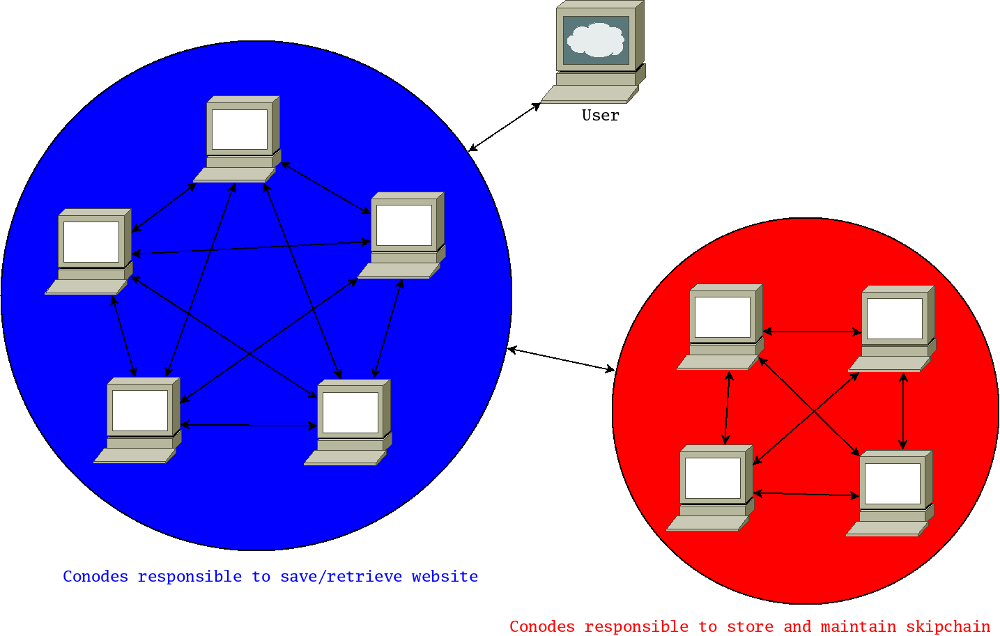
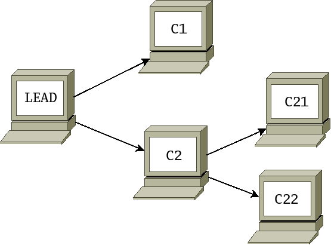
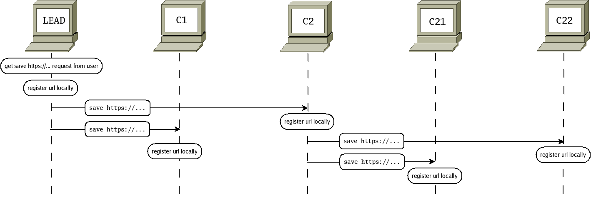
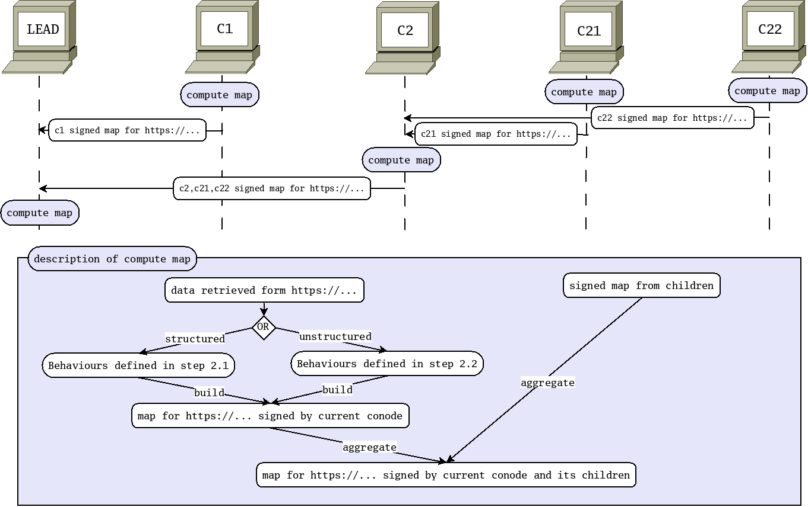
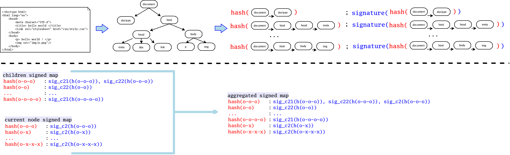
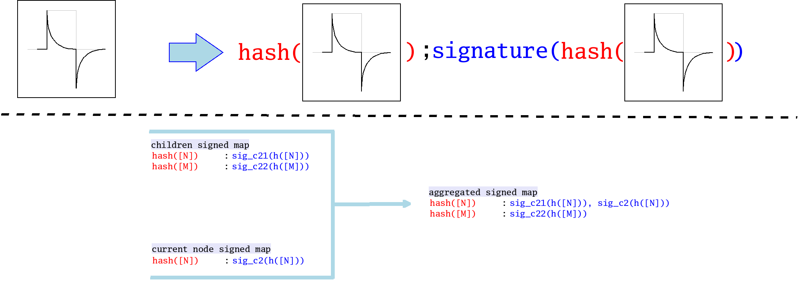
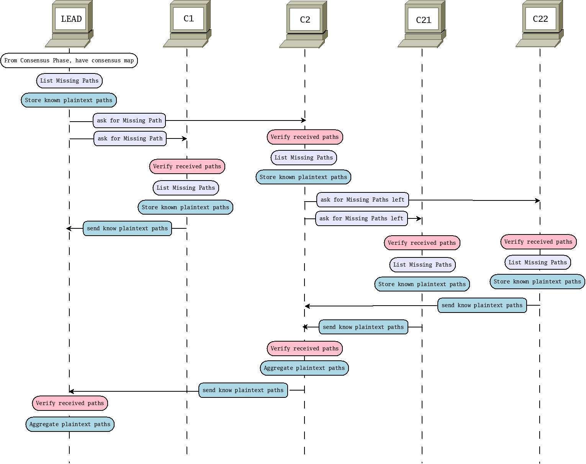
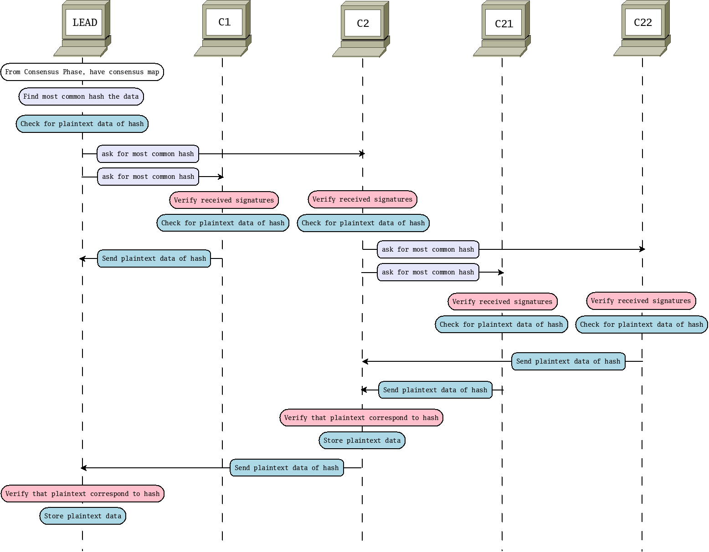

---
# This documentation is not updated. Please read the related Master Thesis report
---

# Decenarch - Decentralized webarchive
---
This client provides two functionality _[saving a webpage](#sav)_ and _[retrieving a website](#ret)_. Allowing respectively to ask the conodes to store the _biggest common subset of a website_ on a skipchain and ask the conodes to retrieve from the skipchain what was store for a certain website at a given time.

## External documentations

* dedis/[Cothority](https://github.com/dedis/cothority/wiki)
* dedis/[Onet](https://github.com/dedis/cothority_template/wiki/ONet-principles)

## Architecture

## Protocols descriptions

### Saving a webpage 
When a user request to save a webpage, the conodes will go through different **phases** in order to serve it. THere will always be a leader of the protocol. **The leader is assumed to be honest**. The phases are the following:

1. **Consenus** : The conodes will all download the webpage locally. Then they will exchange messages until they find which parts of the website are found in a number of conodes sufficiently high which is 80% of the conodes of the Roster.
2. **Request Missing Data** : Once a consensus is found. The leader will request for the plaintext data of the part of the website that it may not have but that are present in a sufficiently high number of conodes.
3. **Cosigning** : Once a common website is created, the leader ask the conodes to sign the data using the CoSi client provided by the dedis/cothority framework.
4. **Additional ressources** : The leader send the signed data to the conodes in order to reach a consensus on the additional data requested by the webpage. By additional data we mean images and css files.
5. **Skipchain saving** : The leader emits a request to store the signed website in the skipchains to the conodes ersponsible of the chain.

In all the figures of the following sections, we assume that there are five conodes responsible for the consenus. Further more, we assume that for communication purposes, they organize themselves as the tree below:

#### Consensus

|step | figure | explaination |
|-----|--------|:-------------|
|1| |The user send a request to the leader with the url to save.  The leader then simply pass the information down to its children and  the operation is repeated until we reaches the leaves of the conode tree.|
|2||The conodes indicates how many time it sees the differents parts of the webpage,  aggreggate it with the result of the children and send it to the parents.  The leader will finally have a vision where  for each parts of the webpage is associated the number of conode that have it too.  The consensus protocol can handle two types of data:  the structured one which are html and css document  and the unstructured one which are images.  For each type of data, you have two step, the conode that individually treat the data and outputs its answer  and the aggregation of that answer with the ones the conode received form its children.  The tables below detail those behaviours.|
|2.1|| **structured data** 1. The conode take the structured document. It turns the document into a logical tree.  Then for each path of the tree, it creates a hash and signs it.  The hash of a path is done by hashing the leaf, then concatenate that hash with the plaintext data of  the parent and hash that new string and repeating the process until the root is reached.  2. From its children, the node receives a map with  the keys being the hashes of the paths of the tree infered from the structured document and  the values a list of signature of the associated hash.  For each of its own hashes, the nodes checks if it is equal to an exsiting hash in the map given by its chlidren.  If yes, it adds its signature to the associated list. Else, it adds an entry to the map with its hash. The updated map will be send to parent.|
|2.2||**unstructured data** 1. The conode take the data and turn it into an array of bytes. Then it hashs it and sign that hash. It outputs the couple ( _h(data)_, sig(_h(data)_).  2. From its children, the node receive a map with  the keys being the hashes of the data and the value a list of signature of the hash by the conodes.  If there is a match, the conode add its signature to the list of signature associated with _h(data)_.  Else, it adds an entry to the map. That updated map will be send to parent.|

It is important to be aware that the nodes send the map to the parents after **verifying that _every_ signature of the map is valid**. If a signature is invalid, it is removed from the list and not send to the parent. When the leader is reached in the conode tree and that the leader has done the operations described in this section, it passes to the next phase: Request Missing Data.

#### Request Missing Data

At this phase, the leader has a map where the keys are the hashes of all the data that has been seen by a sufficient number of conodes and the values are the list of the signatures of these hashes. For structured data, the hashes are the hash of the paths of a consensus tree. For unstructured data, the hashes are the hash of an images and only one of them should be valid. From now, will will refer to it as the _consensus map_.

For structured data, the Request Missing Data phase is necessary in case the leader does not have a certain path but a sufficient number of nodes have it. The leader will request the plaintext data for those paths. If the leader does not require any paths form its children, this phase is skipped.

For unstructured data, the Request Missing Data phase is necessary if the unstructured data chosen is not the one that the leader has. The phase is skipped if the leader has the correct corresponding unstructured data or if no hash has a sufficiently high number of signature. In the latter case, the unstructured data is dropped.

|data type |figure|explaination|
|----------|------|:-----------|
|structured||1. The leader send all the entry of the consensus map for witch it has not the plaintext path already.  2. Upon receiving the part of the consensus map, a receiving conode check each entry signatures  and then choose between two options after checking that the path was indeed signed the correct number of time: a. The node has the plaintext information for the path.  Then it removes it from the missing paths list and store the plaintext associated with the hash of the path. b. The node does not have the plaintext information.  It keeps the entry in the missing paths.  3. The conode send the missing paths left to its children.  4. The process continue until the leaves are reached.  5. The leaves send to its parents the plaintext paths it has.  6. The parents aggregate the paintext paths of their children with theirs after having checked that the plaintext path correspond to the hash.  7. The leader now has all the paths in plaintext. It verifies that the plaintext paths correspond to the hash of the missing paths.  8. The leader then construct the consensus tree from the plaintext paths. From that tree, it builds the original structured page (for example html code).|
|unstructured||1. The leader check if it has the plaintext data of the hash that were signed by a sufficiently high number of conodes. If it has it, the phase stop. Else, it send the hash and the signatures to its children.  2. The receiving conode check the signatures. If all are valid and the number is sufficiently large, it checks if it has the plaintext data.  If it has it, it sends the plaintext data to its parent. Else, it sends it to its children.   3. The protcol continue until the leaves are reached and all nodes reply to its parent.  4. Finally, the leader check that the plaintext data correspond to the hash.|

At the end of this phase, the leader has the plaintext data seen by a sufficiently large number of conodes. So it ends the phase and go into the Cosigning phase.

#### Cosinging

The leader request a cosignature from all the servers on the html,css page or the byte of the image. This phase use the CoSi API provided by the Cothority framework.

#### Additional ressources

In case of an html page, it is possible that the page require additional ressources like a css file or an image in order to be correctly displayed. This phases happen at that moment.

1. The leader parse the signed html page and output the list of additional ressources.
2. The leader restart the whole [saving a webpage protocol](#sav)
3. The leader store the informations retrieved in a table. An entry is of the form: (data, co-signature on the data).

#### Skipchain saving

The leader now has all the pages and the signatures required to save the webpage on the skipchain. So it sends a request to the skipchain conodes in order for them to create a block with the new data and signatures. To do that, it uses the skipchain API of the cothority framework.

### Retrieving a webpage 
